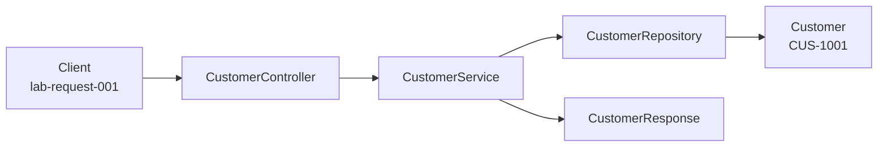

# Layer Flow - Creating Customer CUS-1001

How a create-customer request will move through the layers once the stubs are filled. Nothing is wired yet, this is the intended flow.

## Steps

1. Client sends a create request with correlation ID lab-request-001.
2. CustomerController accepts a CustomerRequest. Input validation will live here at the boundary later.
3. CustomerService applies business rules (assign a unique ID, default status to ACTIVE).
4. CustomerRepository stores the Customer entity. In-memory list first, PostgreSQL much later.
5. A CustomerResponse returns CUS-1001 / ACTIVE without exposing the internal storage type.

## Now vs future

- NOW (Lab 8): packages, stubs, and this documented flow. Stubs throw UnsupportedOperationException.
- FUTURE (out of scope for Lab 8): Spring MVC, validation annotations, JPA, PostgreSQL, React, Kafka.