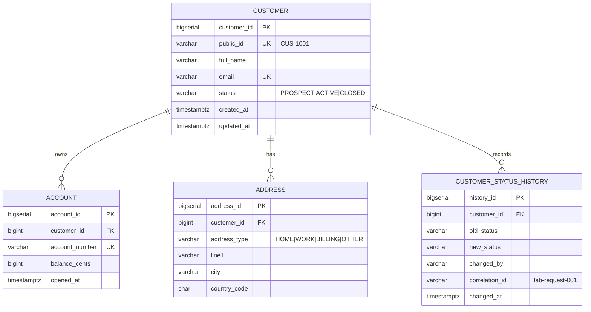

# Lab 37 — ER diagram



## Cardinalities

```text
Customer 1 ---- 0..* Account
Customer 1 ---- 0..* Address
Customer 1 ---- 0..* StatusHistory
```

Every relationship is `0..*` on the child side, never `1..*`. Ravi `CUS-1002` is a `PROSPECT` with
no account and no address, and he must be a valid row. Drawing a mandatory account would break
prospect onboarding, which is the whole point of having a `PROSPECT` status.

The starter's diagram showed `CUSTOMER ||--o| ACCOUNT`, zero or one. That is corrected here to
`||--o{`, zero or many: nothing in the model stops Amina opening a second account.

## Delete rules

| Relationship | ON DELETE | Why |
| --- | --- | --- |
| account → customer | `RESTRICT` | financial records must not vanish because someone deleted a customer. Closing a customer is a status change, never a row delete |
| address → customer | `CASCADE` | an address has no meaning and no audit value without its customer |
| customer_status_history → customer | `RESTRICT` | the audit trail must outlive attempts to delete its subject |

`ON UPDATE` is not specified anywhere because the parent key is a surrogate that never changes.
