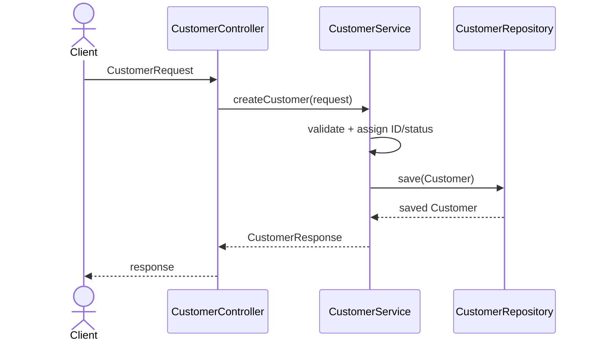
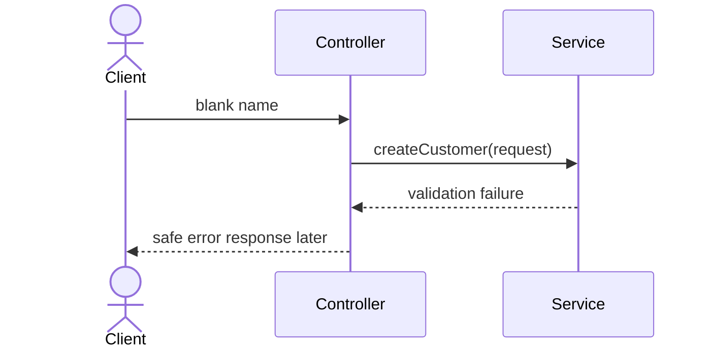

# Customer Request Flow - Module 8 Exercise 5

How a future request to create customer CUS-1001 moves through the layers. No HTTP or database yet, structure only.

## Scenario

Name: Amina Khan, Email: amina@example.test, Requested status: ACTIVE, Correlation ID: lab-request-001

## Step 1 - Success flow

## Step 2 - What changes at each boundary

| Boundary | Input | Output |
| -------- | ----- | ------ |
| Client to controller | Future transport payload | CustomerRequest |
| Service validation | Request DTO | valid domain values |
| Service to repository | Customer entity | saved entity |
| Service to controller | entity/result | CustomerResponse |

## Step 3 - Failure flow

The failure stops at the service. It never reaches the repository, because there is no point saving invalid data. No HTTP status codes yet, that comes later.

## Step 4 - Now vs later

## Now
- Package names and stub responsibilities
- Plain Java types that compile
- Documented flow

## Later
- Spring controller annotations
- Validation annotations
- Repository implementation/JPA
- HTTP response mapping
- Correlation-ID logging

## Step 5 - Readiness check

| Readiness check | Result |
| --------------- | ------ |
| I can locate each class package | Pass |
| I can explain controller to service to repository | Pass |
| I distinguish DTO from entity | Pass |
| I have not added Spring/JPA/database code | Pass |
| I am ready to build the full Maven skeleton in Lab 8 | Pass |
