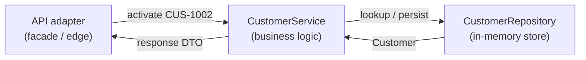

# Lab 15 — Layer Diagram

## Step 1 — Boxes

- API adapter: receives the request, validates DTOs, carries the correlation id.
- CustomerService: owns the activate business rule (PROSPECT -> ACTIVE).
- CustomerRepository: stores/retrieves the Customer (Map keyed by id).

## Step 2 — Arrow labels

- Inward: `activate(CUS-1002)` flows API adapter -> CustomerService -> CustomerRepository
  (lookup CUS-1002, apply PROSPECT -> ACTIVE, persist).
- Outward: the updated `Customer` (Ravi Singh, now ACTIVE) is returned repository ->
  service -> API adapter, then mapped to a response DTO at the edge.

## Step 3 — Correlation

`lab-request-001` crosses the API edge and is passed into service-layer logging, so an
activate call can be traced from the adapter through the service and repository.

## Scope

Pre-lab only — do not finish the full graded lab in this exercise.
