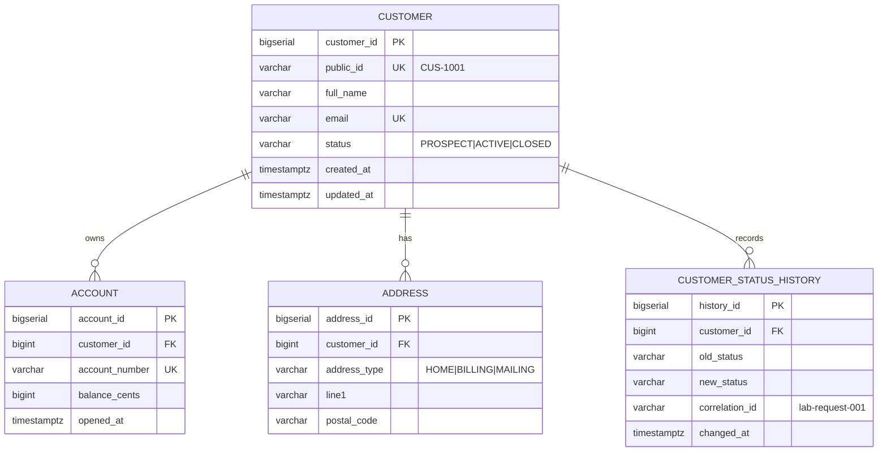

# Lab 37 — ER Sketch

## Reference

| Relationship | Cardinality | Meaning |
| --- | --- | --- |
| customer → account | 1 : 0..N | Amina `ACTIVE` has one account, Ravi `PROSPECT` has none |
| customer → address | 1 : 0..N | several typed addresses per customer |
| customer → status_history | 1 : 0..N | one row per transition |
| account.customer_id | FK → customer.customer_id | mandatory, an account cannot be an orphan |
| customer.customer_id | surrogate PK | `BIGSERIAL`, internal only |
| customer.public_id | UNIQUE business key | `CUS-1001`, what the API exposes |

An `ACCOUNT` cannot exist without a `CUSTOMER`. `customer_id` is `NOT NULL` and carries a foreign
key, so the database refuses the insert rather than trusting the application to be careful.

## Step 2 — Diagram

ASCII form: `CUSTOMER ||--o{ ACCOUNT`. The crow's foot with a circle reads "zero or many", which
is exactly Ravi's case.

### Why email is not the primary key

Email is unique, so it is tempting. It fails as a PK because it is **mutable**. When Amina changes
her address, every child row keyed on the old value has to be rewritten, and every FK either
cascades a mass update or breaks. Worse, the old value may be reissued or reused. A surrogate
`BIGSERIAL` never changes, so identity survives every correction to the data around it. `public_id`
sits in between: stable enough to publish, still not the thing foreign keys point at.

## Step 3 — Cascade policy

| Relationship | ON DELETE | Why |
| --- | --- | --- |
| account.customer_id | `RESTRICT` | financial records must never disappear because someone deleted a customer row. The delete fails, which is the correct answer. Closing a customer is a status change, not a delete |
| address.customer_id | `CASCADE` | an address has no meaning without its customer and no independent audit value |
| customer_status_history.customer_id | `RESTRICT` | the history is the audit trail; deleting the subject must not erase the record of what happened |

`ON UPDATE` is a non-issue here precisely because the parent key is a surrogate that never changes.
That is a second reason to key on `customer_id` rather than `public_id` or `email`.

## Step 4 — Boundary

No Kafka outbox table in this module. No JPA annotations, that is Lab 39. No `EXPLAIN` tuning,
that is Lab 38. Docker stays parked until the graded lab.

## Scope

Pre-lab only — do not finish the full graded lab in this exercise.
