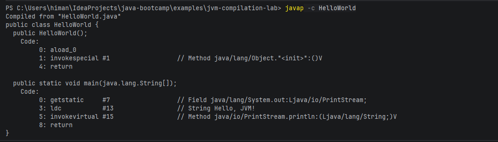
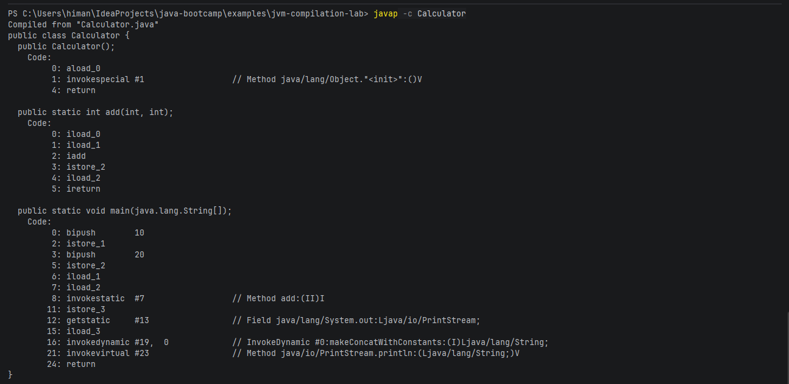
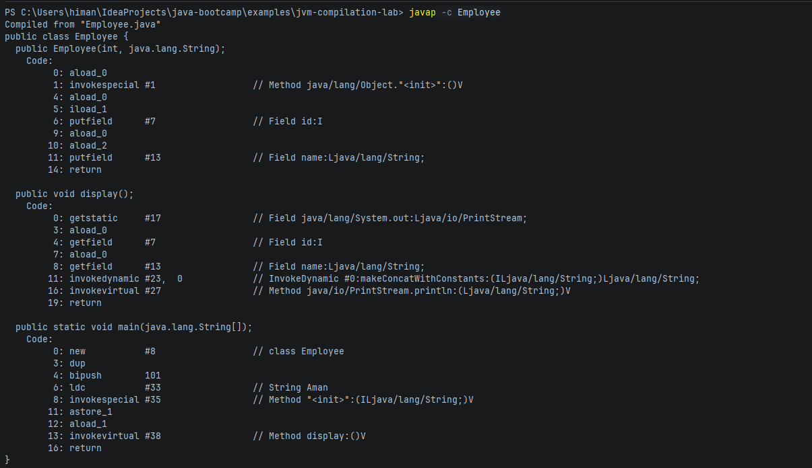
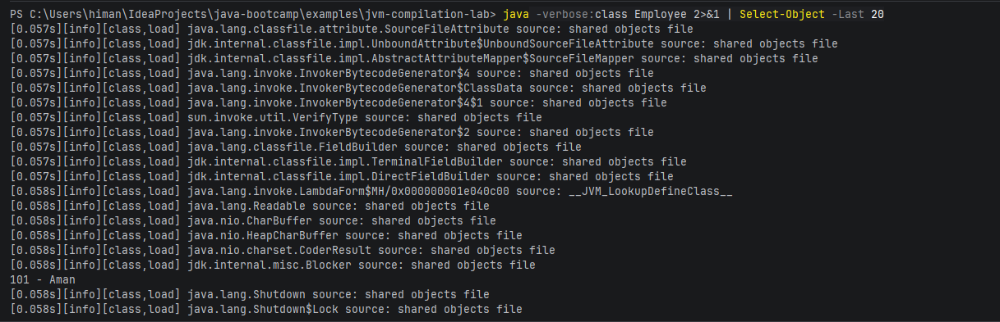
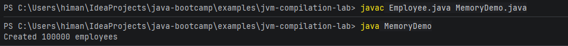
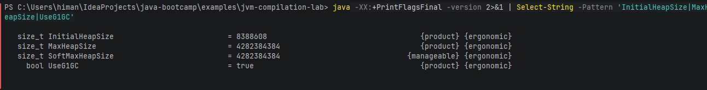
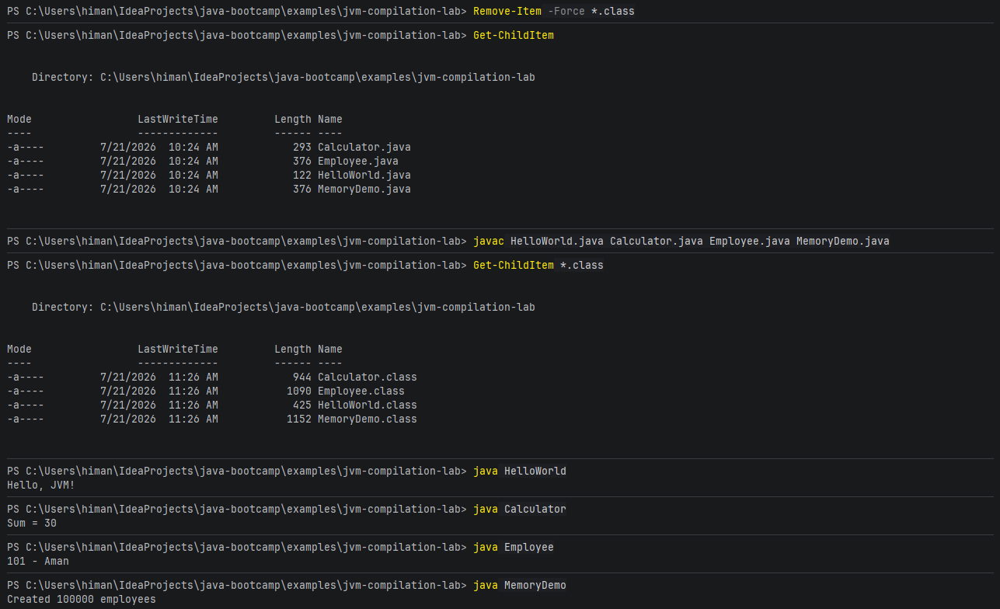

## Step 3
HelloWorld.java = human-written source code
HelloWorld.class = bytecode file the JVM executes
javac created the .class from the .java

## Step 4 - Bytecode Inspection

Key opcodes in HelloWorld:
- getstatic: gets System.out from the heap
- ldc: loads the String "Hello, JVM!"
- invokevirtual: calls println method
- return: exits the method
- 
## Step 5 & 6 - Calculator + Bytecode

Key opcodes in Calculator:
- iload: loads integer variable onto operand stack
- iadd: adds two integers
- istore: stores result into local variable
- invokestatic: calls the static add() method
- ireturn: returns integer value to caller

Stack/Heap table:
- x, y, sum in main -> Stack (main frame)
- a, b, result in add -> Stack (add frame)
- method call add(x,y) -> new stack frame pushed, popped on return
- Calculator class metadata -> Metaspace
- "Sum = 30" String -> Heap

## Step 7 - Employee + Heap Memory

Stack vs Heap for: Employee emp = new Employee(101, "Aman")
- emp reference -> Stack (main frame)
- Employee object (id=101, name="Aman") -> Heap
- String "Aman" -> Heap
- Employee class metadata -> Metaspace

## Step 8 - Class Loading

When java -verbose:class Employee runs, the JVM loads dozens of JDK
classes (Object, String, System) before loading Employee. This is because
Employee depends on them transitively. This explains why JVM apps are
"slow to start" - the JVM must load the entire dependency chain before
running your code.

## Step 9 - MemoryDemo

MemoryDemo creates 100,000 Employee objects on the heap inside an
ArrayList. Each new Employee(i, "Employee-"+i) allocates a new object
on the heap. The ArrayList holds references to all 100,000 objects.

## Step 10 - JVM Memory Flags

- InitialHeapSize = 8388608 (~8 MB) - heap size at JVM startup
- MaxHeapSize = 4282384384 (~4 GB) - maximum heap the JVM will use
- UseG1GC = true - G1 Garbage Collector is the default on JDK 21

## Step 11 - Clean and Recompile

Deleted all .class files, only .java sources remained.
Recompiled all 4 files - 4 new .class files generated.
All 4 programs ran successfully proving .class files are
rebuildable output, not precious artifacts.