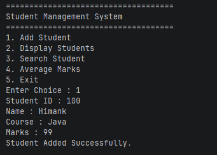
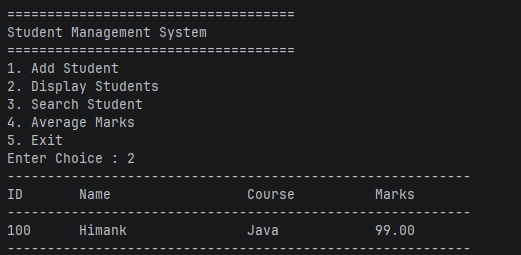
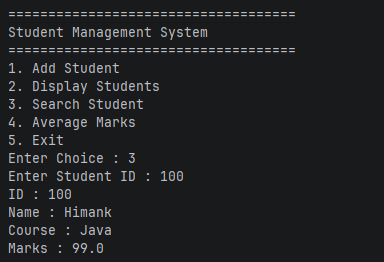
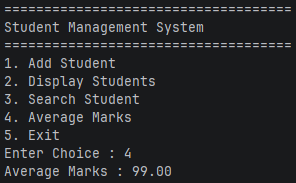
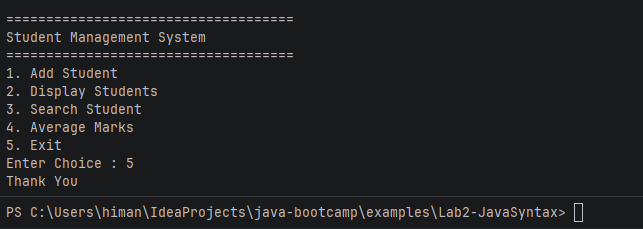

## Lab 2 - Student Management System

### Why the package folder matches com.academy.student
Java needs the folder structure to match the package name so it knows
where to find the class files. If they don't match, it won't compile.

### Why one Scanner
If you create multiple Scanners on System.in they interfere with each
other and skip inputs. One Scanner gets created in Main and passed into
StudentManager so everything reads from the same stream.

### Why studentCount and not students.length
The array is always size 20 but most slots are empty. If you loop to
students.length you'll hit null and crash. studentCount only tracks the
slots that actually have a student in them.

