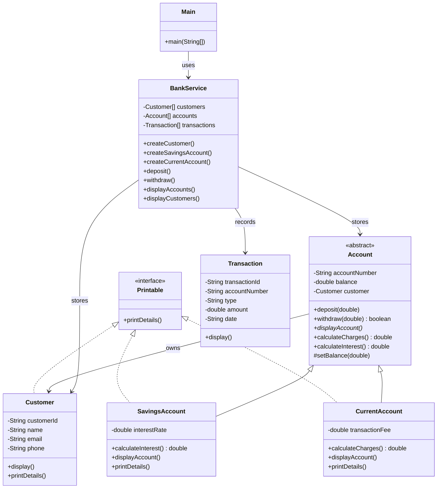

# Lab 3 UML — Class Diagram

```mermaid
classDiagram
    class Printable {
        <<interface>>
        +printDetails()
    }
    class Customer {
        -String customerId
        -String name
        -String email
        -String phone
        +display()
        +printDetails()
    }
    class Account {
        <<abstract>>
        -String accountNumber
        -double balance
        -Customer customer
        +deposit(double)
        +withdraw(double) boolean
        +displayAccount()*
        +calculateCharges() double
        +calculateInterest() double
        #setBalance(double)
    }
    class SavingsAccount {
        -double interestRate
        +calculateInterest() double
        +displayAccount()
        +printDetails()
    }
    class CurrentAccount {
        -double transactionFee
        +calculateCharges() double
        +displayAccount()
        +printDetails()
    }
    class Transaction {
        -String transactionId
        -String accountNumber
        -String type
        -double amount
        -String date
        +display()
    }
    class BankService {
        -Customer[] customers
        -Account[] accounts
        -Transaction[] transactions
        +createCustomer()
        +createSavingsAccount()
        +createCurrentAccount()
        +deposit()
        +withdraw()
        +displayAccounts()
        +displayCustomers()
    }
    class Main {
        +main(String[])
    }

    Printable <|.. Customer
    Printable <|.. SavingsAccount
    Printable <|.. CurrentAccount
    Account <|-- SavingsAccount
    Account <|-- CurrentAccount
    Account --> Customer : owns
    BankService --> Customer : stores
    BankService --> Account : stores
    BankService --> Transaction : records
    Main --> BankService : uses
```